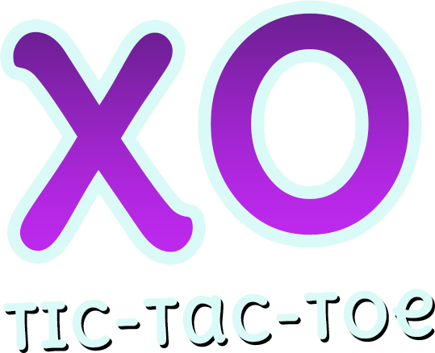

# 🎮 Tic-Tac-Toe React Native Game



**A modern, feature-rich Tic-Tac-Toe game built with React Native and Expo**

*Featuring an intelligent AI opponent, customizable settings, immersive sound effects, and smooth cross-platform gameplay*


---

## 📖 Table of Contents

- [✨ Features](#-features)
- [🚀 Quick Start](#-quick-start)
- [🎯 How to Play](#-how-to-play)
- [🏗️ Technology Stack](#️-technology-stack)
- [📁 Project Structure](#-project-structure)
- [🤖 AI Implementation](#-ai-implementation)
- [🎨 Design Features](#-design-features)
- [📱 Screenshots](#-screenshots)
- [🛠️ Development](#️-development)
- [🔧 Troubleshooting](#-troubleshooting)
- [🔮 Future Enhancements](#-future-enhancements)
- [🤝 Contributing](#-contributing)
- [📄 License](#-license)
- [🙏 Acknowledgments](#-acknowledgments)

---

## ✨ Features

### 🤖 Smart AI Opponent
- **Multiple Difficulty Levels**: Beginner, Intermediate, Hard, and Impossible
- **Minimax Algorithm**: AI uses advanced game theory for optimal moves
- **Dynamic Gameplay**: AI adapts strategy based on difficulty setting

### 🎵 Immersive Experience
- **Sound Effects**: Custom audio feedback for moves, wins, losses, and draws
- **Haptic Feedback**: Tactile responses for enhanced mobile experience
- **Visual Animations**: Smooth transitions and winning line animations

### ⚙️ Customizable Settings
- **Difficulty Selection**: Choose your challenge level
- **Audio Controls**: Toggle sound effects on/off
- **Haptic Controls**: Enable/disable vibration feedback
- **Persistent Settings**: Your preferences are saved locally

### 📱 Cross-Platform
- **iOS**: Full native iOS support with optimized performance
- **Android**: Complete Android compatibility with Material Design elements
- **Web**: Browser-based gameplay available for desktop users
- **Responsive Design**: Adapts seamlessly to different screen sizes and orientations

---

## 🚀 Quick Start

### 📋 Prerequisites

Before you begin, ensure you have the following installed on your system:

- **Node.js** (v16 or later) - [Download here](https://nodejs.org/)
- **npm** or **yarn** package manager
- **Expo CLI** - Install globally with `npm install -g @expo/cli`
- **Git** - [Download here](https://git-scm.com/)

**For mobile development:**
- **iOS Simulator** (macOS only) - Comes with Xcode
- **Android Studio** - For Android Emulator
- **Expo Go App** - Install on your physical device for testing

### ⚡ Installation

**Step 1: Clone the Repository**
```bash
git clone https://github.com/RashedCSEJnU/tic-tac-toe-react-native.git
```

**Step 2: Navigate to Project Directory**
```bash
cd tic-tac-toe-react-native
```

**Step 3: Install Dependencies**
```bash
# Using npm
npm install

# Or using yarn
yarn install
```

**Step 4: Start Development Server**
```bash
npm start
# or
expo start
```

### 🚀 Running on Different Platforms

```bash
# Start development server
npm start

# Run on iOS Simulator (macOS only)
npm run ios
# or press 'i' in the terminal after starting

# Run on Android Emulator
npm run android
# or press 'a' in the terminal after starting

# Run on Web Browser
npm run web
# or press 'w' in the terminal after starting

# Run on Physical Device
# Scan QR code with Expo Go app (iOS/Android)
```

### 📱 Installing Expo Go

**iOS:**
1. Download [Expo Go](https://apps.apple.com/app/expo-go/id982107779) from App Store
2. Open the app and scan the QR code from your terminal

**Android:**
1. Download [Expo Go](https://play.google.com/store/apps/details?id=host.exp.exponent) from Google Play
2. Open the app and scan the QR code from your terminal

---

## 🎯 How to Play

<div align="center">

### 🎮 Game Rules
*Classic Tic-Tac-Toe with a modern twist!*

</div>

**📱 Getting Started:**
1. **Launch the Game**: Open the app and tap "Single Player" from the main menu
2. **Choose Difficulty**: Access Settings (⚙️) to select your preferred AI difficulty level
3. **Make Your Move**: Tap any empty cell on the 3x3 grid to place your mark (X)
4. **Beat the AI**: Try to get three of your marks in a row (horizontally, vertically, or diagonally) before the AI does!
5. **Track Progress**: View your wins, losses, and draws in real-time

**🎚️ Difficulty Levels:**
- 🟢 **Beginner**: Perfect for learning - AI makes occasional mistakes
- 🟡 **Intermediate**: Balanced gameplay - AI is smart but beatable
- 🟠 **Hard**: Challenging experience - AI rarely makes mistakes
- 🔴 **Impossible**: Ultimate challenge - AI plays perfectly using Minimax algorithm

**🎵 Audio & Haptics:**
- **Sound Effects**: Hear feedback for each move, win, loss, or draw
- **Haptic Feedback**: Feel tactile responses on supported devices
- **Settings Control**: Toggle audio and haptics on/off in settings

---

## 🏗️ Technology Stack

<div align="center">

### Frontend Technologies
</div>

| Technology | Version | Purpose |
|------------|---------|---------|
| **React Native** | 0.72.6 | Cross-platform mobile development framework |
| **TypeScript** | 5.1.3 | Type-safe JavaScript with enhanced developer experience |
| **Expo** | ~49.0.15 | Simplified React Native development and deployment |
| **React Navigation** | 6.x | Screen navigation and routing management |
| **Expo Linear Gradient** | ~12.3.0 | Beautiful gradient backgrounds |
| **Expo AV** | ~13.4.1 | Audio playback for sound effects |
| **Expo Haptics** | ~12.4.0 | Tactile feedback for enhanced UX |

<div align="center">

### Backend & Cloud Services
</div>

| Service | Version | Purpose |
|---------|---------|---------|
| **AWS Amplify** | 6.0.9 | Backend-as-a-Service platform |
| **GraphQL** | Latest | API query language (configured for future features) |
| **AsyncStorage** | 1.18.2 | Local data persistence and settings storage |

<div align="center">

### Development & Quality Tools
</div>

| Tool | Purpose |
|------|---------|
| **ESLint** | Code linting and quality assurance |
| **Prettier** | Automated code formatting |
| **Husky** | Git hooks for pre-commit quality checks |
| **TypeScript Compiler** | Static type checking and compilation |
| **Expo CLI** | Development server and build tools |

---

## 📁 Project Structure

```
📦 tic-tac-toe-react-native
├── 📂 src/                           # Source code directory
│   ├── 📂 components/                # Reusable UI components
│   │   ├── 📂 app-bootstrap/         # App initialization component
│   │   ├── 📂 board/                 # Game board components
│   │   │   ├── board.tsx             # Main board component
│   │   │   ├── board-line.tsx        # Winning line animation
│   │   │   └── board.styles.ts       # Board styling
│   │   ├── 📂 button/                # Custom button component
│   │   ├── 📂 text/                  # Styled text component
│   │   ├── 📂 gradient-background/   # Background component
│   │   └── index.ts                  # Component exports
│   ├── 📂 screens/                   # Application screens
│   │   ├── 📂 home/                  # Main menu screen
│   │   ├── 📂 single-player-game/    # Game screen with AI
│   │   ├── 📂 settings/              # Settings configuration
│   │   └── index.ts                  # Screen exports
│   ├── 📂 utils/                     # Game logic and utilities
│   │   ├── board.ts                  # Board state management
│   │   ├── player.ts                 # AI minimax algorithm
│   │   ├── types.ts                  # TypeScript type definitions
│   │   ├── colors.ts                 # Color theme constants
│   │   ├── useSounds.ts              # Audio management hook
│   │   └── index.ts                  # Utility exports
│   ├── 📂 contexts/                  # React context providers
│   │   └── settings-context.tsx      # Global settings management
│   ├── 📂 config/                    # Configuration files
│   │   └── navigator.tsx             # Navigation configuration
│   ├── 📂 graphql/                   # GraphQL related files
│   │   ├── mutations.ts              # GraphQL mutations
│   │   ├── queries.ts                # GraphQL queries
│   │   ├── subscriptions.ts          # GraphQL subscriptions
│   │   └── schema.json               # GraphQL schema
│   ├── API.ts                        # API configuration
│   └── index.tsx                     # Root component
├── 📂 assets/                        # Static assets
│   ├── 📂 fonts/                     # Custom fonts
│   ├── 🖼️ icon.png                   # App icon
│   ├── 🖼️ logo.png                   # App logo
│   ├── 🔊 win.mp3                    # Victory sound
│   ├── 🔊 loss.mp3                   # Defeat sound
│   ├── 🔊 draw.mp3                   # Draw sound
│   └── 🔊 pop_*.wav                  # Move sound effects
├── 📂 amplify/                       # AWS Amplify configuration
│   ├── 📂 backend/                   # Backend configuration
│   │   ├── 📂 api/                   # API configuration
│   │   └── 📂 auth/                  # Authentication setup
│   └── 📂 hooks/                     # Amplify hooks
├── 📄 App.tsx                        # Main app entry point
├── 📄 app.json                       # Expo app configuration
├── 📄 package.json                   # Dependencies and scripts
├── 📄 tsconfig.json                  # TypeScript configuration
├── 📄 babel.config.js                # Babel configuration
└── 📄 README.md                      # Project documentation
```

---

## 🤖 AI Implementation

<div align="center">

### 🧠 Intelligent Minimax Algorithm
*Experience the power of game theory in action*

</div>

The game features a sophisticated AI opponent powered by the **Minimax algorithm** with alpha-beta pruning:

### 🎯 AI Features

| Feature | Description |
|---------|-------------|
| **Perfect Play** | On "Impossible" difficulty, the AI never loses |
| **Adaptive Strategy** | Lower difficulties introduce controlled randomness |
| **Optimized Performance** | Depth-limited search for responsive gameplay |
| **Strategic Opening** | AI varies opening moves to keep games interesting |
| **Dynamic Difficulty** | Four distinct difficulty levels for all skill levels |

### 🔬 Algorithm Details

```typescript
// Simplified Minimax Implementation
function minimax(board: Board, depth: number, isMaximizing: boolean): number {
  // Base case: check for terminal states
  if (isGameOver(board)) {
    return evaluateBoard(board);
  }
  
  if (isMaximizing) {
    // AI turn: maximize score
    let maxEval = -Infinity;
    for (let move of getPossibleMoves(board)) {
      let eval = minimax(makeMove(board, move), depth + 1, false);
      maxEval = Math.max(maxEval, eval);
    }
    return maxEval;
  } else {
    // Player turn: minimize score
    let minEval = Infinity;
    for (let move of getPossibleMoves(board)) {
      let eval = minimax(makeMove(board, move), depth + 1, true);
      minEval = Math.min(minEval, eval);
    }
    return minEval;
  }
}
```

### 🎮 Difficulty Implementation

- **🟢 Beginner (30% optimal)**: AI makes random moves 70% of the time
- **🟡 Intermediate (60% optimal)**: AI makes optimal moves 60% of the time
- **🟠 Hard (85% optimal)**: AI makes optimal moves 85% of the time
- **🔴 Impossible (100% optimal)**: AI always makes the perfect move

---

## 🎨 Design Features

<div align="center">

### 🎭 Modern UI/UX Design
*Crafted for an exceptional user experience*

</div>

### 🎨 Visual Design

| Feature | Description |
|---------|-------------|
| **Modern UI** | Clean, intuitive interface with gradient backgrounds |
| **Custom Typography** | DeliusUnicase font for enhanced readability and game feel |
| **Responsive Design** | Adapts seamlessly to different screen sizes and orientations |
| **Visual Feedback** | Clear indication of game state, moves, and results |
| **Smooth Animations** | Polished transitions and winning line animations |
| **Color Themes** | Carefully selected color palette for optimal visual appeal |

### 🎵 Audio & Haptic Design

- **🔊 Immersive Sound Effects**: Custom audio for moves, wins, losses, and draws
- **📳 Haptic Feedback**: Tactile responses enhance mobile gaming experience
- **🎚️ User Control**: Easy toggle controls for audio and haptic preferences
- **🔇 Accessibility**: Full functionality with or without sound/haptics

### 📱 Cross-Platform Consistency

- **iOS Native Feel**: Follows iOS design guidelines and conventions
- **Android Material Design**: Integrates Material Design principles
- **Web Responsiveness**: Desktop-optimized interface for web browsers
- **Consistent Experience**: Uniform gameplay across all platforms

---

## 📱 Screenshots

<div align="center">

### 🖼️ Game Interface Preview
*Experience the clean and modern design*

</div>

> **Note**: Screenshots coming soon! The game features a beautiful gradient background, clean typography, and intuitive game board design.

**Planned Screenshots:**
- 🏠 **Home Screen**: Main menu with game options
- 🎮 **Game Board**: Active gameplay with move indicators
- ⚙️ **Settings**: Difficulty and preference controls
- 🏆 **Victory Screen**: Win/loss/draw result displays
- 📱 **Mobile Views**: Various device orientations

---

## �️ Development

### 🚀 Development Scripts

```bash
# Development
npm start              # Start Expo development server
npm run ios           # Run on iOS simulator (macOS only)
npm run android       # Run on Android emulator
npm run web           # Run in web browser

# Code Quality
npm run typecheck     # Run TypeScript type checking
npm run lint          # Run ESLint for code linting
npm run format        # Format code with Prettier
npm run format:check  # Check code formatting

# Building (requires Expo CLI)
expo build:ios        # Build for iOS App Store
expo build:android    # Build Android APK/AAB
expo build:web        # Build for web deployment
```

### 🔧 Environment Setup

**Required Environment Variables:**
Create a `.env` file in the root directory (optional for basic functionality):

```env
# AWS Amplify Configuration (optional)
AMPLIFY_APP_ID=your_amplify_app_id
AMPLIFY_REGION=your_aws_region

# Development Configuration
EXPO_PUBLIC_API_URL=your_api_url
```

### 🧪 Testing

```bash
# Run type checking
npm run typecheck

# Lint code
npm run lint

# Format code
npm run format

# Pre-commit hooks (automatically runs)
# - TypeScript compilation
# - ESLint
# - Prettier formatting
```

---

## 🔧 Troubleshooting

<div align="center">

### 🚨 Common Issues & Solutions
*Quick fixes for common development problems*

</div>

### 📱 Installation Issues

**Problem**: `npm install` fails with dependency errors
```bash
# Solution 1: Clear cache and reinstall
npm cache clean --force
rm -rf node_modules package-lock.json
npm install

# Solution 2: Use yarn instead
yarn install
```

**Problem**: Expo CLI not found
```bash
# Install Expo CLI globally
npm install -g @expo/cli
# or
npm install -g expo-cli
```

### 🎮 Runtime Issues

**Problem**: App crashes on startup
- Check if all dependencies are installed: `npm install`
- Verify Node.js version: `node --version` (should be 16+)
- Try clearing Expo cache: `expo start -c`

**Problem**: Sound effects not working
- Ensure device volume is turned up
- Check if sound is enabled in app settings
- Verify audio files exist in `assets/` directory

**Problem**: App not loading on physical device
- Ensure device and computer are on same WiFi network
- Try using tunnel connection: `expo start --tunnel`
- Check if Expo Go app is updated to latest version

### 🔧 Development Issues

**Problem**: TypeScript errors
```bash
# Check TypeScript configuration
npm run typecheck

# Fix common TS issues
npm install @types/react @types/react-native
```

**Problem**: Metro bundler issues
```bash
# Clear Metro cache
npx react-native start --reset-cache
# or
expo start -c
```

### 📞 Getting Help

If you're still experiencing issues:

1. **Check Expo Documentation**: [docs.expo.dev](https://docs.expo.dev)
2. **React Native Troubleshooting**: [react-native docs](https://reactnative.dev/docs/troubleshooting)
3. **Open an Issue**: [GitHub Issues](https://github.com/RashedCSEJnU/tic-tac-toe-react-native/issues)
4. **Join Discord**: [Expo Discord Community](https://discord.gg/4gtbPAdpaE)

---

## 🔮 Future Enhancements

<div align="center">

### 🚀 Planned Features & Improvements
*The roadmap for even more exciting gameplay*

</div>

### 🎮 Gameplay Features
- [ ] **Multiplayer Mode**: Real-time online gameplay with WebSocket integration
- [ ] **Local Multiplayer**: Pass-and-play mode for two human players
- [ ] **Tournament Mode**: Bracket-style competitions with AI and human players
- [ ] **AI Personalities**: Different AI playing styles (Aggressive, Defensive, Random)
- [ ] **Board Variations**: 4x4 and 5x5 game boards for extended gameplay
- [ ] **Time Challenges**: Speed rounds with countdown timers

### 🎨 UI/UX Improvements
- [ ] **Custom Themes**: Multiple visual themes (Dark mode, Classic, Neon, etc.)
- [ ] **Animations**: Enhanced move animations and victory celebrations
- [ ] **Sound Packs**: Multiple audio theme options
- [ ] **Accessibility**: Enhanced support for screen readers and motor disabilities
- [ ] **Tablet Optimization**: Enhanced layouts for larger screens

### 📊 Player Features
- [ ] **User Authentication**: Player profiles and cloud save synchronization
- [ ] **Statistics Tracking**: Detailed gameplay analytics and progress charts
- [ ] **Achievements System**: Unlockable rewards and milestone badges
- [ ] **Leaderboards**: Global and friend rankings
- [ ] **Player Ratings**: ELO-style rating system based on AI difficulty beaten

### 🛠️ Technical Improvements
- [ ] **Offline Mode**: Full functionality without internet connection
- [ ] **Push Notifications**: Game reminders and multiplayer invitations
- [ ] **Cloud Saves**: Cross-device game state synchronization
- [ ] **Performance Optimization**: Reduced memory usage and faster load times
- [ ] **Internationalization**: Multi-language support (Bengali, Hindi, Spanish, etc.)

### 🎯 Advanced AI Features
- [ ] **Machine Learning**: AI that learns from player patterns
- [ ] **Dynamic Difficulty**: AI that adjusts based on player skill level
- [ ] **Opening Book**: Database of optimal opening moves
- [ ] **Endgame Database**: Perfect play in all endgame positions

---

## 🤝 Contributing

<div align="center">

### 👥 We Welcome Contributors!
*Help make this game even better*

</div>

Contributions are welcome! Whether you're fixing bugs, adding features, improving documentation, or suggesting enhancements, your help is appreciated.

### 🚀 Quick Start for Contributors

1. **Fork the Repository**: Click the "Fork" button on GitHub
2. **Clone Your Fork**: 
   ```bash
   git clone https://github.com/your-username/tic-tac-toe-react-native.git
   ```
3. **Create a Branch**: 
   ```bash
   git checkout -b feature/your-feature-name
   ```
4. **Make Changes**: Implement your improvements
5. **Test Thoroughly**: Ensure everything works on iOS, Android, and Web
6. **Submit PR**: Create a pull request with a clear description

### 📋 Development Guidelines

#### Code Quality Standards
- **TypeScript**: Follow strict TypeScript conventions
- **ESLint**: Run `npm run lint` and fix all warnings
- **Prettier**: Use `npm run format` for consistent formatting
- **Type Safety**: Ensure `npm run typecheck` passes without errors

#### Testing Requirements
- **Cross-Platform**: Test on iOS, Android, and Web platforms
- **Device Testing**: Test on both simulators/emulators and real devices
- **Performance**: Ensure smooth 60fps gameplay
- **Accessibility**: Verify screen reader compatibility

#### Commit Guidelines
```bash
# Good commit messages
git commit -m "feat: add sound toggle in settings"
git commit -m "fix: resolve AI infinite loop on impossible difficulty"
git commit -m "docs: update installation instructions"

# Commit types: feat, fix, docs, style, refactor, test, chore
```

### 🐛 Bug Reports

Found a bug? Please open an issue with:
- **Clear Title**: Describe the issue briefly
- **Steps to Reproduce**: List exact steps to reproduce the bug
- **Expected vs Actual**: What should happen vs what actually happens
- **Environment**: Device, OS version, app version
- **Screenshots**: If applicable, include screenshots or videos

### 💡 Feature Requests

Have an idea? We'd love to hear it! Please include:
- **Use Case**: Why would this feature be useful?
- **Implementation Ideas**: How might it work?
- **Mockups**: Visual representations if applicable
- **Priority**: How important is this to you?

### 🏆 Recognition

Contributors will be:
- Added to the contributors list
- Mentioned in release notes for significant contributions
- Given credit in the app's About section (planned feature)

---

## 📄 License

<div align="center">

### 📜 Open Source License
*Free to use, modify, and distribute*

</div>

This project is open source and available under the **[MIT License](LICENSE)**.

```
MIT License

Copyright (c) 2024 Tic-Tac-Toe React Native

Permission is hereby granted, free of charge, to any person obtaining a copy
of this software and associated documentation files (the "Software"), to deal
in the Software without restriction, including without limitation the rights
to use, copy, modify, merge, publish, distribute, sublicense, and/or sell
copies of the Software, and to permit persons to whom the Software is
furnished to do so, subject to the following conditions:

The above copyright notice and this permission notice shall be included in all
copies or substantial portions of the Software.

THE SOFTWARE IS PROVIDED "AS IS", WITHOUT WARRANTY OF ANY KIND, EXPRESS OR
IMPLIED, INCLUDING BUT NOT LIMITED TO THE WARRANTIES OF MERCHANTABILITY,
FITNESS FOR A PARTICULAR PURPOSE AND NONINFRINGEMENT.
```

**What this means:**
- ✅ **Commercial Use**: You can use this in commercial projects
- ✅ **Modification**: You can modify the code as needed
- ✅ **Distribution**: You can distribute the original or modified versions
- ✅ **Private Use**: You can use this privately without restrictions
- ⚠️ **Attribution**: Please include the original copyright notice

---

## 🙏 Acknowledgments

<div align="center">

### 🤝 Special Thanks
*Standing on the shoulders of giants*

</div>

We extend our heartfelt gratitude to the amazing open-source community and the following projects that made this game possible:

### 🛠️ Technology Partners

| Organization | Contribution |
|--------------|-------------|
| **[Expo Team](https://expo.dev)** | For the excellent development platform and seamless deployment tools |
| **[React Native Community](https://reactnative.dev)** | For continuous improvements, support, and the amazing framework |
| **[AWS Amplify](https://aws.amazon.com/amplify/)** | For providing robust backend infrastructure and GraphQL integration |
| **[Meta/Facebook](https://github.com/facebook/react-native)** | For creating and maintaining React Native |
| **[Microsoft](https://github.com/microsoft/TypeScript)** | For TypeScript, making JavaScript development safer and more productive |

### 🎨 Design & Assets

- **[Google Fonts](https://fonts.google.com/)**: For the beautiful Delius Unicase typography
- **[Expo Vector Icons](https://icons.expo.fyi/)**: For comprehensive icon sets
- **[React Native Community](https://github.com/react-native-async-storage/async-storage)**: For AsyncStorage implementation

### 📚 Learning Resources

- **[React Native Documentation](https://reactnative.dev/docs/getting-started)**: Comprehensive guides and references
- **[Expo Documentation](https://docs.expo.dev/)**: Detailed platform documentation
- **[TypeScript Handbook](https://www.typescriptlang.org/docs/)**: Essential TypeScript learning resource
- **[Stack Overflow Community](https://stackoverflow.com/)**: For countless solutions and discussions

### 🧠 Algorithm Inspiration

- **John von Neumann & Oskar Morgenstern**: For game theory foundations
- **Claude Shannon**: For minimax algorithm concepts
- **Chess Programming Community**: For alpha-beta pruning optimizations

### 👥 Community Support

- **GitHub Community**: For version control and collaboration platform
- **npm Community**: For package management and distribution
- **React Native Discord**: For real-time community support
- **Expo Discord**: For platform-specific assistance

---

<div align="center">

## 🎮 Ready to Play?

### 🚀 Get Started Now!

```bash
git clone https://github.com/RashedCSEJnU/tic-tac-toe-react-native.git
cd tic-tac-toe-react-native
npm install
npm start
```

<p align="center">
  
</p>

### 🏆 Can You Beat the Impossible AI?

**Choose your difficulty and find out!**

- 🟢 **Beginner**: Perfect for learning the ropes
- 🟡 **Intermediate**: A fair challenge for casual players  
- 🟠 **Hard**: For those who want a real challenge
- 🔴 **Impossible**: Only the best strategists survive

---

**Enjoy playing!** 🎮 Challenge yourself against our intelligent AI and see if you can achieve the impossible!

*Made with ❤️ by the React Native community*

</div>
